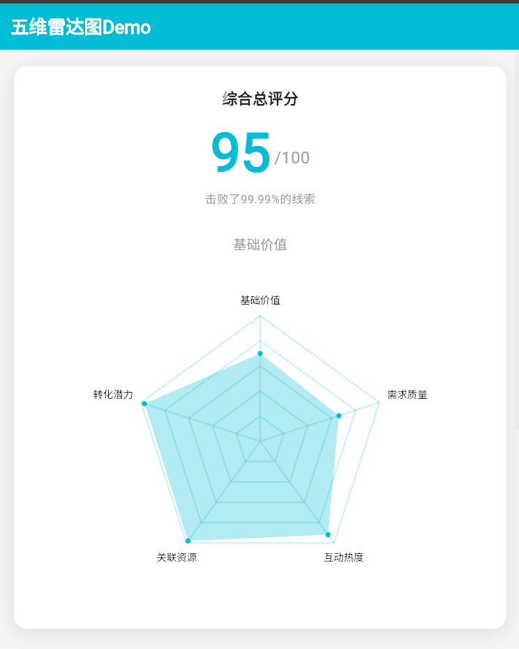
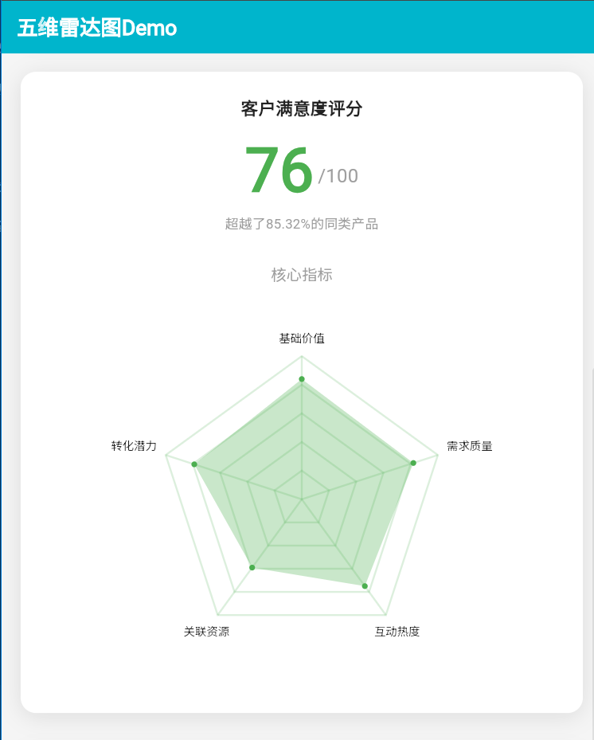
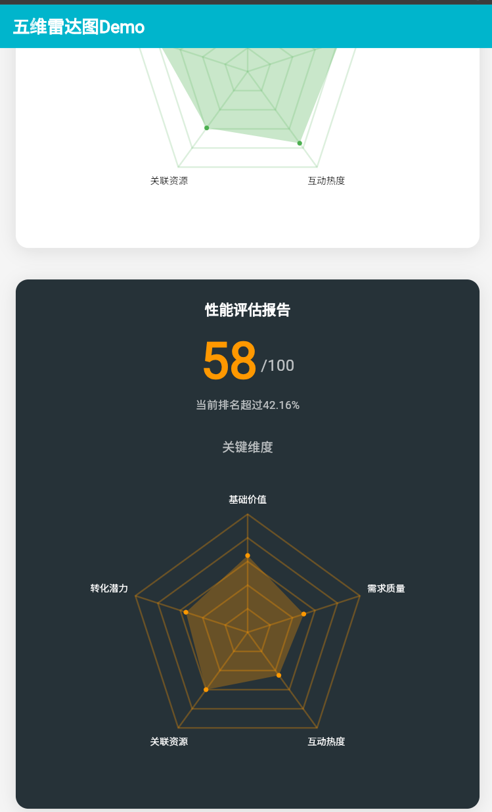

# 五维雷达图评分组件 Demo

一个基于 Flutter 开发的五维雷达图展示组件库，提供动画效果丰富的评分卡片和五维雷达图可视化功能。

## ✨ 功能特性

- 🎯 **流畅动画效果** - 分数递增动画和雷达图渐现效果
- 📊 **五维雷达图** - 清晰展示多维度数据分析
- 🎨 **高度可定制** - 支持主题色、背景色、文字等全方位自定义
- ⚡ **高性能渲染** - 基于 Canvas 的高效图形绘制
- 📱 **响应式设计** - 适配不同屏幕尺寸和设备
- 🔧 **易于集成** - 简洁的 API 设计，开箱即用

## 📸 效果预览

本项目包含多个样式示例：

### 默认样式 - 蓝色主题评分卡片


### 绿色主题 - 客户满意度评分


### 深色主题 - 橙色性能评估


## 🚀 快速开始

### 环境要求

- Flutter SDK >= 3.0.0
- Dart >= 2.17.0

### 运行项目

```bash
# 克隆项目
git clone <repository-url>
cd score_rating_demo

# 获取依赖
flutter pub get

# 运行项目
flutter run
```

### 运行测试

```bash
flutter test
```

## 📦 组件介绍

### ScoreRatingCard - 基础评分卡片

功能完整的评分展示卡片，包含动画分数显示和雷达图可视化。

```dart
ScoreRatingCard(
  score: 95,
  percentage: 99.99,
  title: '综合评分',
  primaryColor: Colors.blue,
  radarData: {
    '基础价值': 90.0,
    '需求质量': 92.0,
    '互动热度': 88.0,
    '关联资源': 85.0,
    '转化潜力': 87.0,
  },
)
```

#### 主要参数

- `score` - 总分数 (0-100)
- `percentage` - 击败百分比
- `title` - 卡片标题（可选）
- `primaryColor` - 主题色
- `radarData` - 雷达图数据映射
- `backgroundColor` - 背景色（可选）

### ComprehensiveScoreCard - 增强版评分卡片

提供更丰富的动画效果和文档说明的高级版本。

```dart
ComprehensiveScoreCard(
  totalScore: 95.0,
  defeatPercentage: "99.99%",
  primaryColor: Color(0xFF00BCD4),
  radarData: {
    '基础价值': 90.0,
    '需求质量': 92.0,
    '互动热度': 88.0,
    '关联资源': 85.0,
    '转化潜力': 87.0,
  },
)
```

### PentagonRadarChart - 五维雷达图

独立的雷达图组件，支持自定义数据和样式。

```dart
PentagonRadarChart(
  data: {'维度1': 80, '维度2': 90, '维度3': 75, '维度4': 85, '维度5': 88},
  size: 200,
  primaryColor: Colors.blue,
)
```

## 🎨 自定义样式

### 主题配色

```dart
ScoreRatingCard(
  primaryColor: Color(0xFF4CAF50),           // 绿色主题
  backgroundColor: Color(0xFFF8F9FA),        // 浅灰背景
  textColor: Colors.black,                   // 文字颜色
  secondaryTextColor: Colors.grey[600],      // 辅助文字颜色
)
```

### 深色主题

```dart
ScoreRatingCard(
  backgroundColor: Color(0xFF263238),        // 深色背景
  textColor: Colors.white,                   // 白色文字
  secondaryTextColor: Colors.white70,        // 半透明白色
  primaryColor: Color(0xFFFF9800),           // 橙色主题
  radarFillColor: Color(0xFFFF9800).withAlpha(120),
  radarGridColor: Color(0xFFFF9800).withAlpha(80),
)
```

## 🏗️ 项目结构

```
lib/
├── main.dart                              # 应用入口
├── pages/
│   ├── demo_page.dart                     # 主要演示页面
│   └── ComprehensiveScoreCardPage.dart    # 增强版组件演示页面
└── widgets/
    ├── score_rating_card.dart             # 基础评分卡片组件
    ├── ComprehensiveScoreCard.dart        # 增强版评分卡片组件
    └── pentagon_radar_chart.dart          # 五维雷达图组件
```

## 🔧 技术实现

### 动画系统

- **AnimationController** - 统一管理动画时间轴（2秒持续时间）
- **分数动画** - 0-60% 时间段，easeOutCubic 曲线
- **雷达图动画** - 30-100% 时间段，与分数动画形成优雅过渡

### 图形渲染

- **CustomPainter** - 高性能 Canvas 绘制
- **数学计算** - 精确的五边形顶点定位
- **分层渲染** - 网格 → 数据区域 → 标签的绘制顺序

### 响应式设计

- **弹性布局** - 支持不同屏幕尺寸
- **自适应间距** - 根据内容动态调整
- **可选尺寸** - 支持固定宽高设置

## 🎯 使用场景

- **用户评分展示** - 综合能力、学习成绩等
- **产品评估报告** - 功能、性能、体验等维度
- **数据分析仪表板** - 多维度指标可视化
- **企业绩效展示** - 销售、服务、创新等方面

## 🧪 测试

项目包含基础的 Widget 测试，验证组件的正常渲染和数据显示。

```bash
flutter test
```

## 📄 许可证

MIT License

## 🤝 贡献

欢迎提交 Issue 和 Pull Request 来改进这个项目。

---

**注意**: 本项目为演示项目，展示了 Flutter 中复杂 UI 组件的实现方法，包括自定义绘制、动画系统和响应式设计等核心技术。
